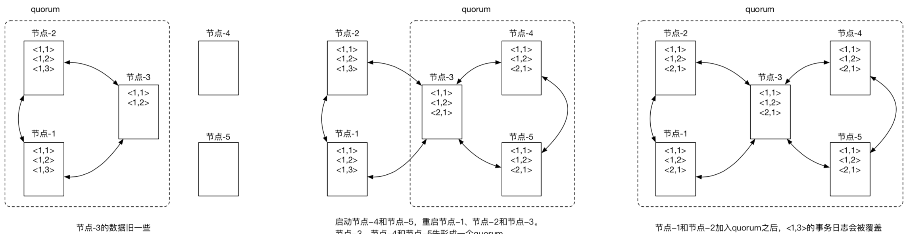

我自己搭的etcd集群的时候，随便在网上找了个demo就搞定了，没关注这方面的问题。被评为问到就蒙了。今天我遇到的问题都复盘一遍。

## 1.etcd怎么添加一个节点？
我之前没搭建过zookeeper、consul之类的集群，所有没关注过。
被问到这个问题，我当时回答是改配置文件，其实是不行的。因为，因为重新启动启动各个节点的时候，会有一致性问题: 需要重启，如果让数据版本比较旧的节点成为了leader，处理了写入请求后，当其他节点重新加入后，这个节点成为最新版本的节点，数据覆盖了之前的版本.



这个时候要通过etcdctl动态添加。加入本身有3个节点：
```shell script
etcd --name myetcd1 --listen-client-urls http://0.0.0.0:23791 --advertise-client-urls http://0.0.0.0:23791 --listen-peer-urls http://0.0.0.0:23801 --initial-advertise-peer-urls http://0.0.0.0:23801  --initial-cluster-token etcd-cluster-test --initial-cluster-state new --initial-cluster myetcd1=http://0.0.0.0:23801,myetcd2=http://0.0.0.0:23802,myetcd3=http://0.0.0.0:23803
etcd --name myetcd2 --listen-client-urls http://0.0.0.0:23792 --advertise-client-urls http://0.0.0.0:23792 --listen-peer-urls http://0.0.0.0:23802 --initial-advertise-peer-urls http://0.0.0.0:23802  --initial-cluster-token etcd-cluster-test --initial-cluster-state new --initial-cluster myetcd1=http://0.0.0.0:23801,myetcd2=http://0.0.0.0:23802,myetcd3=http://0.0.0.0:23803
etcd --name myetcd3 --listen-client-urls http://0.0.0.0:23793 --advertise-client-urls http://0.0.0.0:23793 --listen-peer-urls http://0.0.0.0:23803 --initial-advertise-peer-urls http://0.0.0.0:23803  --initial-cluster-token etcd-cluster-test --initial-cluster-state new --initial-cluster myetcd1=http://0.0.0.0:23801,myetcd2=http://0.0.0.0:23802,myetcd3=http://0.0.0.0:23803
```
查看member列表：
```shell script
etcdctl --endpoints=http://127.0.0.1:23791 member list
```
```shell script
47170e1b92eadb07: name=myetcd1 peerURLs=http://0.0.0.0:23801 clientURLs=http://0.0.0.0:23791 isLeader=true
d150980031282a6b: name=myetcd2 peerURLs=http://0.0.0.0:23802 clientURLs=http://0.0.0.0:23792 isLeader=false
e5f114f803598601: name=myetcd3 peerURLs=http://0.0.0.0:23803 clientURLs=http://0.0.0.0:23793 isLeader=false
```
新增一个节点4，这个时候要用v2的客户端提交，第二条命令--initial-cluster-state为existing:
```shell script
etcdctl --endpoints=http://127.0.0.1:23791 member add myetcd4 http://0.0.0.0:23804
etcd --name myetcd4 --listen-client-urls http://0.0.0.0:23794 --advertise-client-urls http://0.0.0.0:23794 --listen-peer-urls http://0.0.0.0:23804 --initial-advertise-peer-urls http://0.0.0.0:23804 --initial-cluster-token etcd-cluster-test --initial-cluster-state existing --initial-cluster myetcd1=http://0.0.0.0:23801,myetcd2=http://0.0.0.0:23802,myetcd3=http://0.0.0.0:23803,myetcd4=http://0.0.0.0:23804
```
再查看member列表：
```shell script
etcdctl --endpoints=http://127.0.0.1:23791 member list
```
```shell script
47170e1b92eadb07, started, myetcd1, http://0.0.0.0:23801, http://0.0.0.0:23791
7a7c1f85b7c409ad, started, myetcd4, http://0.0.0.0:23804, http://0.0.0.0:23794
d150980031282a6b, started, myetcd2, http://0.0.0.0:23802, http://0.0.0.0:23792
e5f114f803598601, started, myetcd3, http://0.0.0.0:23803, http://0.0.0.0:23793
```
我还试过集群初始化只有一个节点，但是通过etcdctl添加一个节点后，不能形成quorum，集群不可用。

## 添加了一个节点后，客户端怎么修改？
我的回答是，我每个微服务改下配置。评委说这样效率很低。
我后来查了一下etcd是有一个叫grpc_proxy的代理，可以利用给etcd集群做个反向代理。
```shell script
etcd grpc-proxy start --endpoints=${etcd-add1},${etcd-add2},${etcd-add3} --listen-addr=0.0.0.0:23790
```
可以起几个节点，用lvs做个虚拟ip，就可以实现高可用了

