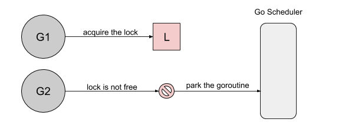

最近在读《Go 语言设计与实现》的时候，里面提到golang里的互斥锁分正常模式和饥饿模式，饥饿模式是golang 1.9版本引入的优化。饥饿这个次有点抽象，我调研了一下为什么做了这方面的优化。
下面引入一下[YiXu Zhang 写的文章](https://morioh.com/p/0a103ab09f46)


文章里的例子：
```go
func main() {
    done := make(chan bool, 1)
    var mu sync.Mutex

    // goroutine 1
    go func() {
        for {
            select {
            case <-done:
                return
            default:
                mu.Lock()
                time.Sleep(100 * time.Microsecond)
                mu.Unlock()
            }
        }
    }()

    // goroutine 2
    for i := 0; i < 10; i++ {
        time.Sleep(100 * time.Microsecond)
        mu.Lock()
        mu.Unlock()
    }
    done <- true
}
```

如果用golang 1.8运行上面这个例子:
```shell script
Lock acquired per goroutine:
g1: 7200216
g2: 10
```
互斥锁被第二个协程捕获十次，而第一个协程则捕获了700万次。首先协程1获得锁后睡眠100ms，当协程2尝试获取锁时，它将被添加到锁的队列（FIFO）中，并且进入等待状态。

然后，协程1释放了锁。协程2也被唤醒了，被标记为可运行，然后等待调度器在线程上运行。

但是这个时候协程1又去获得锁。

到协程2去获得锁的时候，发现锁已经被其他线程持有了。


这个问题可以总结为：刚被唤起的协程与在运行的协程竞争时，大概率会获取不到锁。
本身golang 1.8也有部分机制缓解这个问题，可以让协程进入自旋，但是条件比较苛刻：只有在多核机器，并且有一个处理器队列为空。

golang 1.9新增了饥饿模式，在这个模式下，在协程1释放锁的时候，直接将锁移交给第一位waiter。用golang 1.9以上的版本运行示例：
```shell script
Lock acquired per goroutine:
g1: 57
g2: 10
```

现在加锁的过程是这样的：
* 如果互斥锁处于初始化状态，就会直接通过置位 mutexLocked 加锁；
* 如果互斥锁处于 mutexLocked 并且在普通模式下工作，就会进入自旋，执行 30 次 PAUSE 指令消耗 CPU 时间等待锁的释放；
* 如果当前 Goroutine 等待锁的时间超过了 1ms，互斥锁就会切换到饥饿模式；
* 互斥锁在正常情况下会通过 sync.runtime_SemacquireMutex 函数将尝试获取锁的 Goroutine 切换至休眠状态，等待锁的持有者唤醒当前 Goroutine；
* 如果当前 Goroutine 是互斥锁上的最后一个等待的协程或者等待的时间小于 1ms，当前 Goroutine 会将互斥锁切换回正常模式；
解锁流程：
* 当互斥锁已经被解锁时，那么调用 sync.Mutex.Unlock 会直接抛出异常；
* 当互斥锁处于饥饿模式时，会直接将锁的所有权交给队列中的下一个等待者，等待者会负责设置 mutexLocked 标志位；
* 当互斥锁处于普通模式时，如果没有 Goroutine 等待锁的释放或者已经有被唤醒的 Goroutine 获得了锁，就会直接返回；在其他情况下会通过 sync.runtime_Semrelease 唤醒对应的 Goroutine；