rtmp是基于tcp的，下面结合wireshark来整理rtmp与客户端的交互。测试用的是芒果台的这个流：rtmp://58.200.131.2:1935/livetv/

1.握手
* 客户端要等收到S1之后才能发送C2
* 客户端要等收到S2之后才能发送其他信息（控制信息和真实音视频等数据）
* 服务端要等到收到C0之后发送S1
* 服务端必须等到收到C1之后才能发送S2
* 服务端必须等到收到C2之后才能发送其他信息（控制信息和真实音视频等数据）
* 握手开始于客户端发送C0、C1块。服务器收到C0或C1后发送S0和S1。
* 当客户端收齐S0和S1后，开始发送C2。当服务器收齐C0和C1后，开始发送S2。
* 当客户端和服务器分别收到S2和C2后，握手完成。

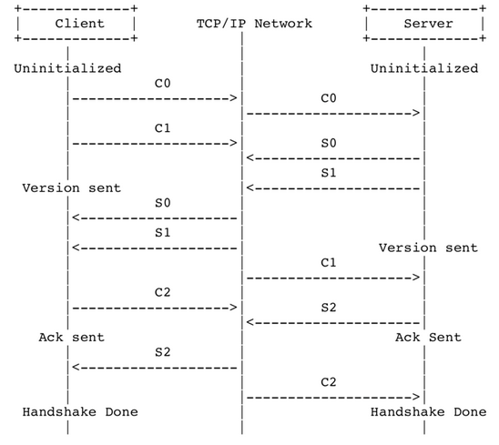

从wireshark中也可以看到c1、c2和c2发送

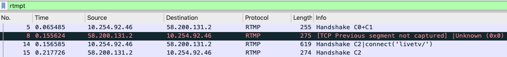

2.发送connect指令

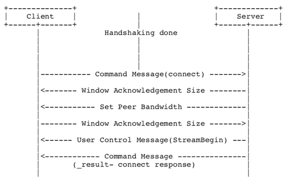

从wireshark查看客户端发送connect的到服务端：

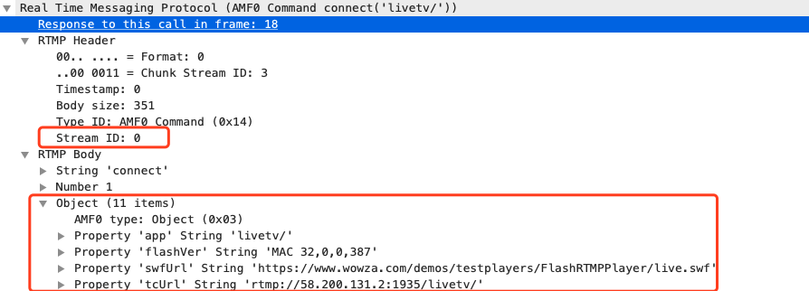

连接信息包含了app名称和地址一些信息，这个streamID据说是一个消息的唯一标识。这里面为0说明这个消息是初始的0消息。Chunk stream ID:message会拆分成多个chunk，同一个Chunk Stream ID必然属于同一个Message。

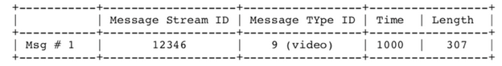
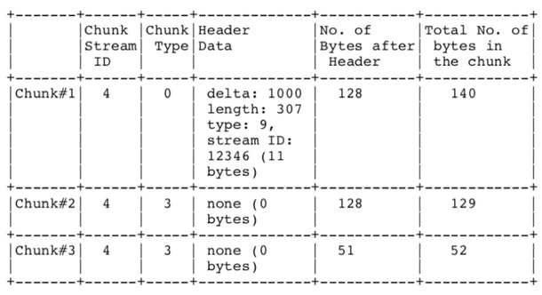

message type id(消息的类型id)：表示实际发送的数据的类型，如8代表音频数据、9代表视频数据。
Format：指的是chunk type。共有4种不同的格式，其中第一种格式字段为0，可以表示其他三种表示的所有数据，但由于其他三种格式是基于对之前chunk的差量化的表示，因此可以更简洁地表示相同的数据，实际使用的时候还是应该采用尽量少的字节表示相同意义的数据。因为type0是表示不同数据，其他是差量，所以可以想象如果搜不到type0的包说明这个流肯定有问题。可以通过“rtmpt.header.format == 0”过滤。

之后是设置确认窗口大小、带宽协议消息
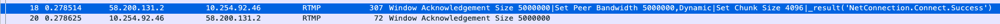

服务器发送用户控制消息中的“流开始”(Stream Begin)消息到客户端。服务器发送命令消息中的“结果”(_result)，通知客户端连接的状态。可以看到链接已经建立成功。

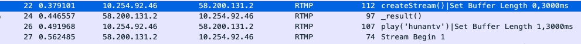

3.建立一个网络流

网络流代表了发送多媒体数据的通道。服务器和客户端之间只能建立一个网络连接，且多个网络流可以复用这一个网络连接。
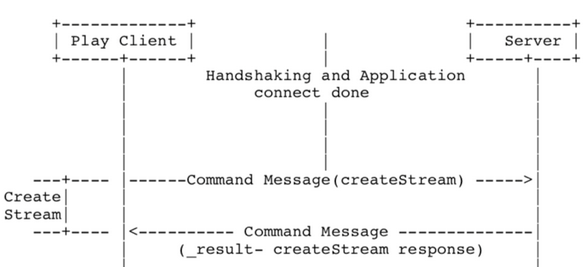

服务器收到请求后向客户端发送_result()，对创建流的消息进行响应。此时NetStream创建完成。

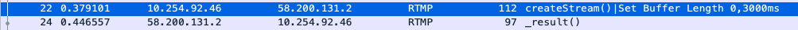

4.播放

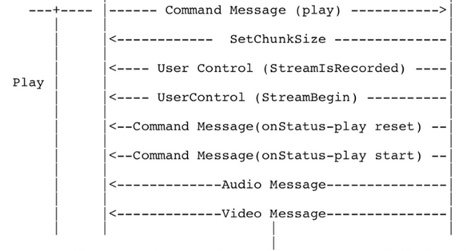

主要过程是客户端把play指令发到服务端，服务端返回一个状态，之后就是返回音频和视频数据。

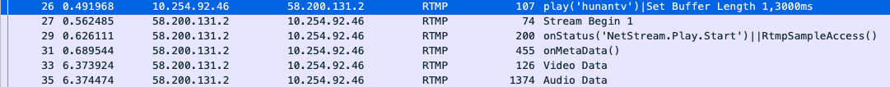