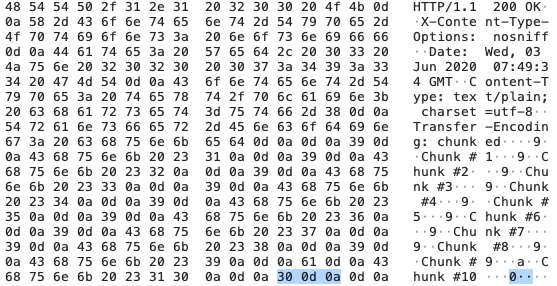

处理tcp层的逻辑的时候就需要处理粘包问题。因为tcp是基于流的，保证有序，但是流里面消息是没有边界的，tcp会对应用消息做分包，所以会有粘包/分包问题。

使用应用层的协议就不需要，例如http，websocket。这些应用层协议是基于tcp，本身解决粘包问题。

* Http

http的header有"Content-Length"这个就设置了应用消息的长度，接收方可以根据这个长度来感知应用消息的长度。

http在"Transfer-Encoding: chunked"场景下是没有Content-Length的。在头部加入 Transfer-Encoding: chunked 之后，就代表这个报文采用了分块编码。这时，报文中的实体需要改为用一系列分块来传输。每个分块包含十六进制的长度值和数据，长度值独占一行，长度不包括它结尾的 CRLF（\r\n），也不包括分块数据结尾的 CRLF。最后一个分块长度值必须为 0，对应的分块数据没有内容，表示实体结束。
例如golang以下代码：
```go
func main() {
	http.HandleFunc("/hello", ChunkServer)
	http.ListenAndServe("127.0.0.1:6666", nil)
}

func ChunkServer(w http.ResponseWriter, req *http.Request) {
	flusher, ok := w.(http.Flusher)
	if !ok {
		panic("expected http.ResponseWriter to be an http.Flusher")
	}
	w.Header().Set("X-Content-Type-Options", "nosniff")
	for i := 1; i <= 10; i++ {
		fmt.Fprintf(w, "Chunk #%d\n", i)
		flusher.Flush() // Trigger "chunked" encoding and send a chunk...
		time.Sleep(500 * time.Millisecond)
	}
}
```
上面这段代码会隐性地触发golang的http chunk。
通过Wireshark抓包看到:

每次flusher.Flush都会形成一个分块，每个分块长度为9。最后一个分块为0，为消息主体的结束标识。

* Websocket

WebSocket 会把应用的消息分割成一个或多个帧，接收方接到到多个帧会进行组装，等到接收到完整消息之后再通知接收端。
WebSocket 数据帧格式如下：
```
 0                   1                   2                   3
 0 1 2 3 4 5 6 7 8 9 0 1 2 3 4 5 6 7 8 9 0 1 2 3 4 5 6 7 8 9 0 1
 +-+-+-+-+-------+-+-------------+-------------------------------+
 |F|R|R|R| opcode|M| Payload len |    Extended payload length    |
 |I|S|S|S|  (4)  |A|     (7)     |             (16/64)           |
 |N|V|V|V|       |S|             |   (if payload len==126/127)   |
 | |1|2|3|       |K|             |                               |
 +-+-+-+-+-------+-+-------------+ - - - - - - - - - - - - - - - +
 |     Extended payload length continued, if payload len == 127  |
 + - - - - - - - - - - - - - - - +-------------------------------+
 |                               |Masking-key, if MASK set to 1  |
 +-------------------------------+-------------------------------+
 | Masking-key (continued)       |          Payload Data         |
 +-------------------------------- - - - - - - - - - - - - - - - +
 :                     Payload Data continued ...                :
 + - - - - - - - - - - - - - - - - - - - - - - - - - - - - - - - +
 |                     Payload Data continued ...                |
 +---------------------------------------------------------------+
```
字段解析如下：
1 FIN:0表示不是最后一个分片，1表示是最后一个分片。
2 RSV1, RSV2, RSV3：
3 一般情况下全为 0。当客户端、服务端协商采用 WebSocket 扩展时，这三个标志位可以非0，且值的含义由扩展进行定义。如果出现非零的值，且并没有采用 WebSocket 扩展，连接出错。
4 Opcode：
        %x0：表示一个延续帧。当 Opcode 为 0 时，表示本次数据传输采用了数据分片，当前收到的数据帧为其中一个数据分片；
        %x1：表示这是一个文本帧（text frame）；
        %x2：表示这是一个二进制帧（binary frame）；
        %x3-7：保留的操作代码，用于后续定义的非控制帧；
        %x8：表示连接断开；
        %x9：表示这是一个心跳请求（ping）；
        %xA：表示这是一个心跳响应（pong）；
        %xB-F：保留的操作代码，用于后续定义的控制帧。

可以通过FIN就能感知应用消息的边界。

* TCP

golang处理tcp粘包/分包问题，网上搜到的处理方法思路大概是：在数据包中添加长度字段。看看goim（bilibili毛剑开发的）是怎么处理的：
api/comet/grpc/protocol.go的代码
```go
func (p *Proto) ReadTCP(rr *bufio.Reader) (err error) {
	var (
		bodyLen   int
		headerLen int16
		packLen   int32
		buf       []byte
	)
    // 从reader中把header取出来
	if buf, err = rr.Pop(_rawHeaderSize); err != nil {
		return
	}
    // 从头部中读取包的长度、头部长度、版本等
	packLen = binary.BigEndian.Int32(buf[_packOffset:_headerOffset])
	headerLen = binary.BigEndian.Int16(buf[_headerOffset:_verOffset])
	p.Ver = int32(binary.BigEndian.Int16(buf[_verOffset:_opOffset]))
	p.Op = binary.BigEndian.Int32(buf[_opOffset:_seqOffset])
	p.Seq = binary.BigEndian.Int32(buf[_seqOffset:])
	if packLen > _maxPackSize {
		return ErrProtoPackLen
	}
	if headerLen != _rawHeaderSize {
		return ErrProtoHeaderLen
	}
	if bodyLen = int(packLen - int32(headerLen)); bodyLen > 0 {
        // 从reader中读取body内容，如果reader里面没达到可以取的长度，则返回错误
		p.Body, err = rr.Pop(bodyLen)
	} else {
		p.Body = nil
	}
	return
}
```
下面是internel/comet/serve_tcp.go的读取片段：
```go
for {
		...
		if err = p.ReadTCP(rr); err != nil {
			break
		}
		if white {
			whitelist.Printf("key: %s read proto:%v\n", ch.Key, p)
		}
		if p.Op == grpc.OpHeartbeat {
			tr.Set(trd, hb)
			p.Op = grpc.OpHeartbeatReply
			p.Body = nil
			// NOTE: send server heartbeat for a long time
			if now := time.Now(); now.Sub(lastHb) > serverHeartbeat {
				if err1 := s.Heartbeat(ctx, ch.Mid, ch.Key); err1 == nil {
					lastHb = now
				}
			}
			if conf.Conf.Debug {
				log.Infof("tcp heartbeat receive key:%s, mid:%d", ch.Key, ch.Mid)
			}
			step++
		} else {
			if err = s.Operate(ctx, p, ch, b); err != nil {
				break
			}
		}
		...
	}
```